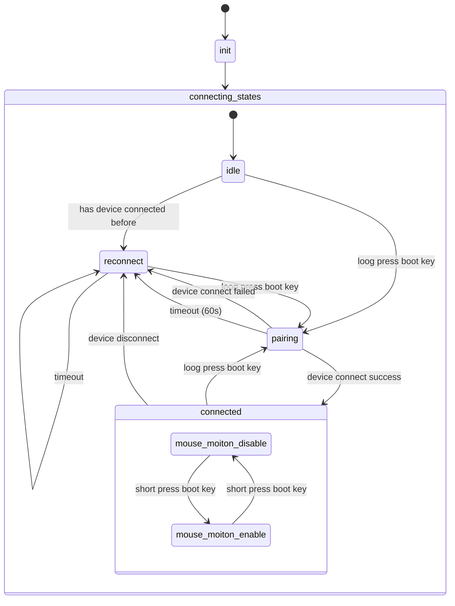

# ESP32 BLE 鼠标

本项目是基于 ESP32 开发的 BLE 鼠标。

## LED 控制

CORE ESP32 核心板带有 2 个 LED。开发者可以参考表 4-1 进行相应引脚的控制。

| LED 编号 | 对应 GPIO | 引脚功能    | 描述       |
| -------- | --------- | ----------- | ---------- |
| D4       | GPIO12    | GPIO12 配置 | 高电平有效 |
| D5       | GPIO13    | GPIO13 配置 | 高电平有效 |

## 按键介绍

CORE ESP32 核心板带有两个按键，其中 BOOT 按键可实现 BOOT 下载功能，RST 按键可实现复位功能，引脚控制参考表 4-2。

| 按键编号 | 对应 GPIO | 引脚功能                       | 描述       |
| -------- | --------- | ------------------------------ | ---------- |
| BOOT     | GPIO9     | 当按下按键时，芯片进入下载模式 | 低电平有效 |
| RST      |           | 当按下按键时，芯片复位         | 低电平有效 |

## 状态切换

## 使用方法

### 启动

连接电源即启动。

### 配对

长按 BOOT 按键超过 5 秒进入蓝牙配对模式，此模式下 LED D4 和 LED D5 同步每秒闪烁 3 次。

### 重新连接

启动和断开连接之后会自动尝试连接上次连接的蓝牙设备，处于重连状态时 LED D4 和 LED D5 同步每秒闪烁 1 次。

### 开关鼠标动作

短按 BOOT 开关鼠标动作。
开启鼠标动作时，设备模拟鼠标随机移动，此时 LED D4、D5 交替闪烁，每秒 2 次。
关闭鼠标动作时，LED D4、D5 常亮。
